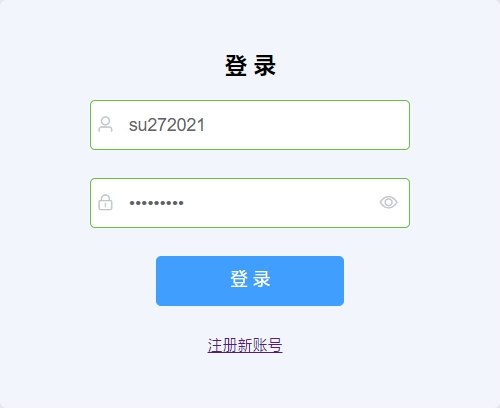
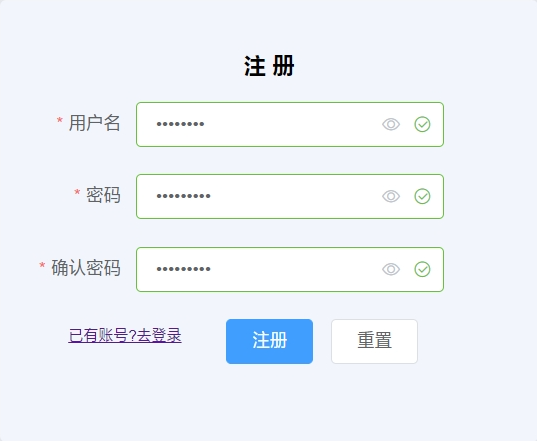
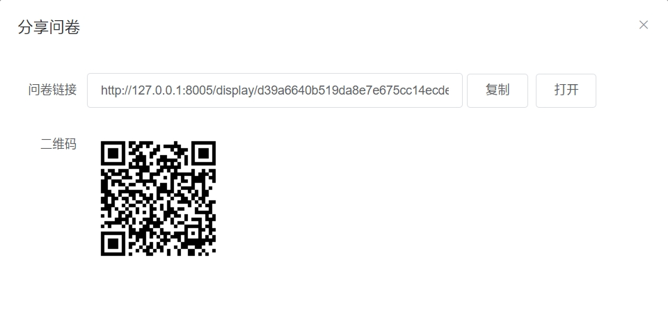
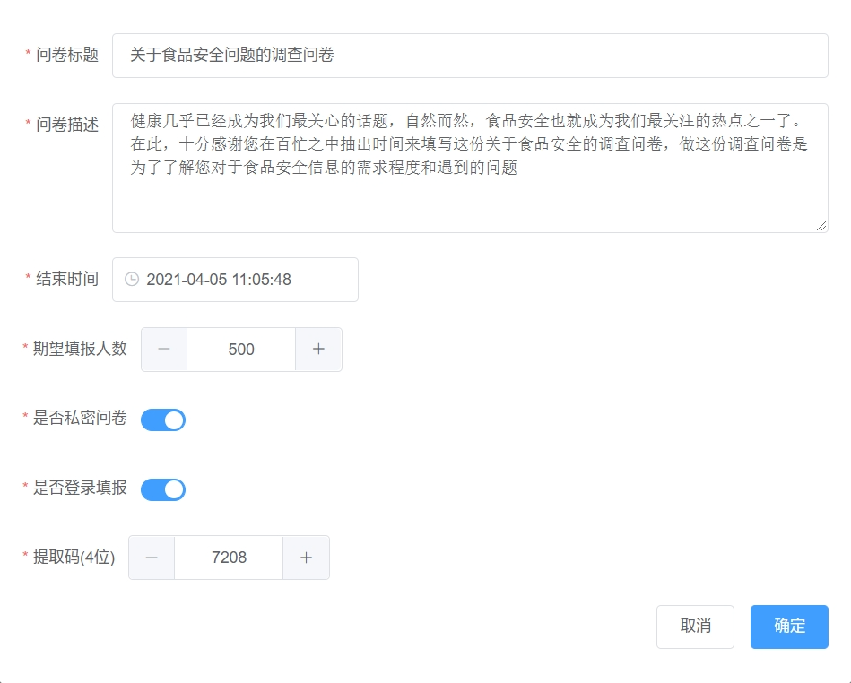
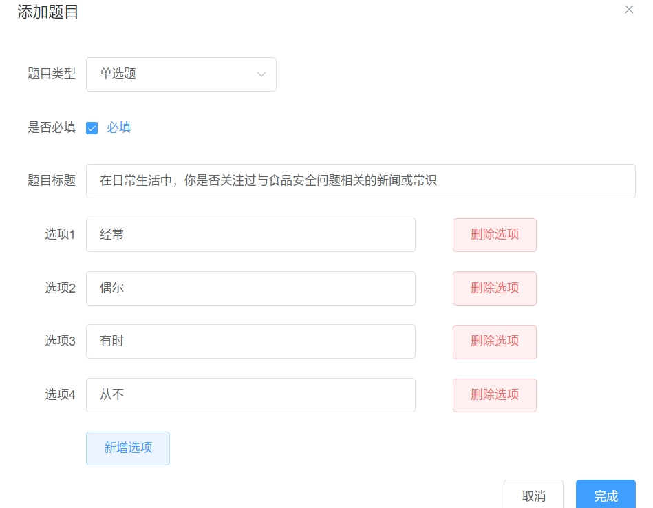
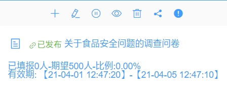
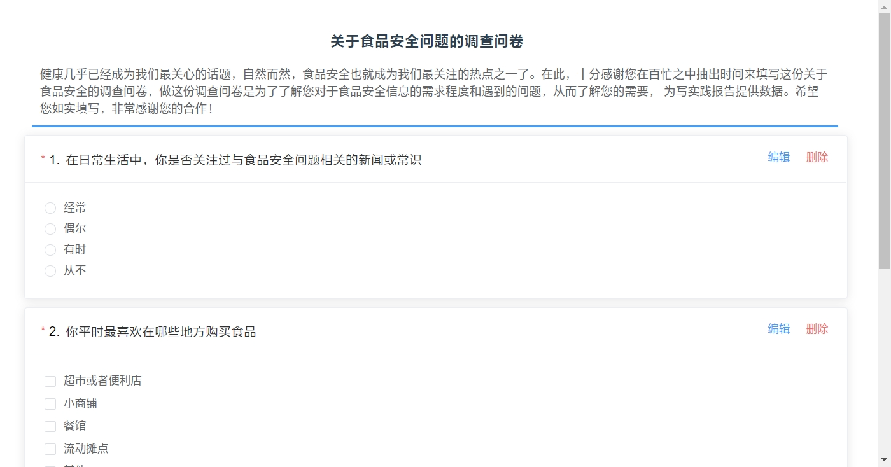

# vue 仿问卷星
## 体验地址
<a href="http://fb.xcylw.top">formhub-免费问卷</a>

## 技术架构
* 后端 php+mysql
* 前端 vue+vue-router+axios+element_ui
## 实现功能
1. 用户登录注册存在性校验
2. 问卷分布撤回、添加、删除、编辑、私密问卷提取码设置、无需登录填报、问卷填报有效期、问卷数据重置
3. 问卷问题及选项添加、修改、删除、必|可选
4. 填报有效性控制(一个登录用户一票或者一个session一票)防止重复提交和刷票、问卷过期控制、失密问卷需要输入验证码校验、必选项校验
## 运行方法
后端:
1. 导入sql
2. 在conf/conf.php 配置相关数据库连接参数
3. 服务器设置相应的跨域
前端:
1. npm i 下包
2. npm run build 打包
3. 上传到服务器
4. 服务器需要进行代理转发/api设置
详看: <a href="https://blog.csdn.net/weixin_42043407/article/details/115391787">vue项目部署到apache过程及所遇相关问题</a>
## 页面展示

